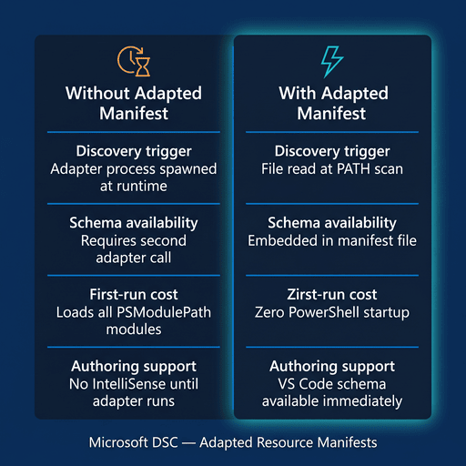

`DscResource.Authoring` is a PowerShell module for authoring Microsoft Desired
State Configuration (DSC) resources. It helps module authors create DSC v3
resource manifests for PowerShell class-based DSC resources and work with DSC
manifest files in automation.

1. <a href="#what">What is DscResource.Authoring?</a>
1. <a href="#why">Why use it?</a>
1. <a href="#commands">Available commands</a>
1. <a href="#workflow">Authoring workflow</a>

<a name="what" />

## What is DscResource.Authoring?

`DscResource.Authoring` provides commands that inspect PowerShell class-based
DSC resources and generate DSC v3 adapted resource manifests. Adapted resource
manifests improve DSC resource discovery and execution speed by giving `dsc.exe`
metadata up front. They also provide schema context so commands such as
`dsc resource schema --resource <resource-type>` can return the resource schema.

Microsoft DSC discovers PowerShell adapted resource manifests through the
[PowerShell discovery extension][02]. The extension searches module paths from
`$env:PSModulePath` for DSC manifest files, including adapted resource manifest
files. When you publish these files with your PowerShell module and users
install the module from PowerShell Gallery, DSC can discover the manifests from
the installed module path.

The module reads PowerShell source files and module manifests, discovers classes
marked with `[DscResource()]`, extracts resource properties and capabilities,
and creates JSON-compatible manifest objects.

Use this module when you need to prepare PowerShell DSC resources for use with
Microsoft DSC v3.

<a name="why" />

## Why use DscResource.Authoring?

- **Automate manifest generation** — create adapted resource manifests from
	existing PowerShell class-based DSC resources.
- **Use class metadata** — derive schema properties from `[DscProperty()]`
	attributes, enums, property types, and class methods.
- **Improve schema output** — use comment-based help and property overrides to
	produce clearer JSON schema descriptions and constraints.
- **Bundle manifests** — combine adapted resource manifests into a DSC resource
	manifest list.
- **Improve DSC discovery and execution** — produce manifest files that give
	`dsc.exe` resource metadata and schema information before it invokes the
	resource.
- **Publish with modules** — ship adapted resource manifests in your module so
	the PowerShell discovery extension can find them through `$env:PSModulePath`.
- **Support resource schema commands** — provide schema context for commands
	such as `dsc resource schema --resource <resource-type>`.

The diagram below shows the concrete differences between running a PowerShell
DSC resource with and without an adapted resource manifest across four areas:
how discovery is triggered, when schema information becomes available, the
first-run cost, and authoring tool support.

   
  <em>Figure 1: DSC resource discovery and execution (with and without an adapted resource manifest.)</em>

Without a manifest, DSC must spawn the PowerShell adapter at runtime, make a
second adapter call to retrieve the schema (if it even can), and load all modules on
`$env:PSModulePath` before the resource can run. With a manifest, discovery is
a file read, the schema is embedded in the manifest, PowerShell startup cost
is eliminated, and VS Code can provide IntelliSense immediately from the
embedded schema.

<a name="commands" />

## Available commands

| Command                             | Description                                                                              |
|-------------------------------------|------------------------------------------------------------------------------------------|
| `New-DscAdaptedResourceManifest`    | Creates adapted resource manifest objects from class-based PowerShell DSC resources.     |
| `Import-DscAdaptedResourceManifest` | Imports adapted resource manifest objects from `.dsc.adaptedResource.json` files.        |
| `Import-DscResourceManifest`        | Imports a DSC resource manifest list from a `.dsc.manifests.json` file.                  |
| `New-DscPropertyOverride`           | Creates a `DscPropertyOverride` object for use with `Update-DscAdaptedResourceManifest`. |
| `New-DscResourceManifest`           | Creates a DSC resource manifests list for bundling multiple resources in a single file.  |
| `Update-DscAdaptedResourceManifest` | Applies post-processing overrides to adapted resource manifest objects.                  |

See [[Command Reference]] for syntax and usage details.

<a name="workflow" />

## Authoring workflow

The typical workflow is:

1. Write or update a PowerShell class-based DSC resource.
1. Add comment-based help above each `[DscResource()]` class.
1. Generate adapted resource manifests with `New-DscAdaptedResourceManifest`.
1. Apply schema refinements with `Update-DscAdaptedResourceManifest` when needed.
1. Bundle manifests with `New-DscResourceManifest`.
1. Save the output as `.dsc.adaptedResource.json` or `.dsc.manifests.json`.

Start with [[Getting Started]], then review [[Examples]] and the
[[Command Reference]].

<!-- Link references -->
[01]: https://learn.microsoft.com/en-us/powershell/dsc/overview?view=dsc-3.0
[02]: https://github.com/PowerShell/DSC/blob/main/extensions/powershell/powershell.discover.ps1
